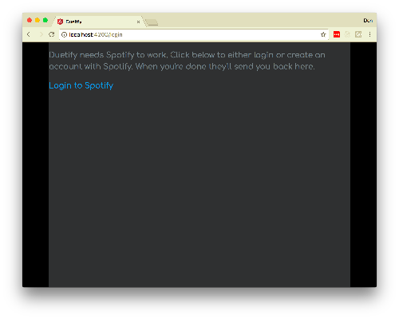
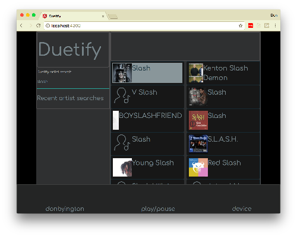
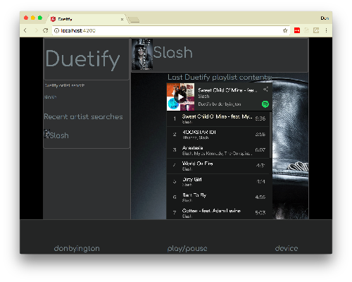
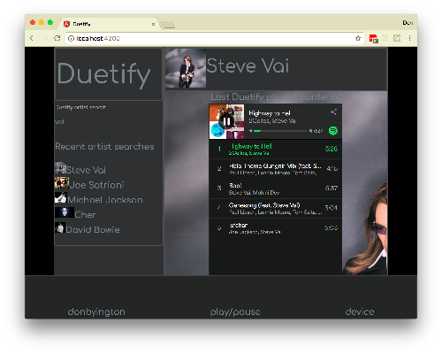
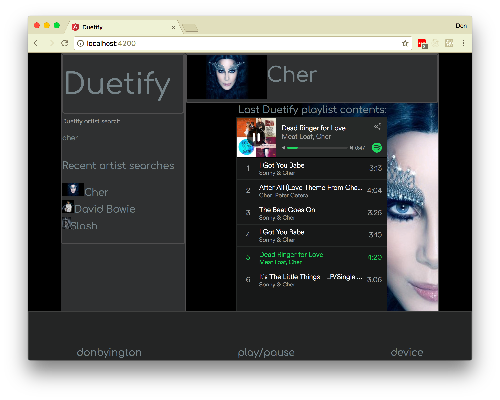

# duetify

Search and play your favorite artist's collaborations from Spotify.

## What duetify does

duetify helps you find artist collaboration tracks. Lookup your favorite artist and discover the tracks they have done with other artists.

## Screen shots
[](./images/Login.png)
[](./images/SearchSlash.png)
[](./images/SlashPlaylist.png)
[](./images/VaiPlaylist.png)
[](./images/CherPlaylist.png)

## Getting Started

These instructions will get you a copy of the project up and running on your local machine for development and testing purposes. See deployment for notes on how to deploy the project on a live system.

### Prerequisites

* npm
* [duetify server](https://github.com/dbyington/duetify-server)

### Running the front-end

```
cd <to your work location>
git clone https://github.com/dbyington/duetify.git
git clone https://github.com/dbyington/duetify-server.git
```
Create the file '.env' in the root of the server with the following content:
```
CLIENT_ID='your Spotify API client id'
CLIENT_SECRET='your Spotify API client secret'
SERVER_PORT='8080' #the port you want the server on
```
Then run
```
npm install
npm start
```
See the duetify server [README.md](https://github.com/dbyington/duetify-server/blob/readme/README.md) for more information running the server.

## Running the tests

Apart from the Angular tests, no tests currently exist. You are welcome to write some, please see [CONTRIBUTING](./CONTRIBUTING.md).

## Deployment

Work is in process on deploying the server to Google Cloud Functions. Meanwhile, deploying to [Heroku](https://heroku.com) should be straight forward as the back-end currently has no database requirement.

## Built With

* [Angular](https://angular.io) - Front-end framework
* [Koa](https://koajs.com) - Back-end framework

## Contributing

Please read [CONTRIBUTING.md](./CONTRIBUTING.md) for details on our code of conduct, and the process for submitting pull requests to us.

## Versioning

We use [SemVer](http://semver.org/) for versioning. For the versions available, see the [tags on this repository](https://github.com/dbyington/duetify/tags). No releases tagged yet as duetify is still in development.

## Authors

* **Don Byington** - [dbyington](https://github.com/dbyington)

See also the list of [contributors](https://github.com/dbyington/duetify/contributors) who participated in this project.

## License

This project is licensed under the MIT License - see the [LICENSE.md](LICENSE.md) file for details

## Acknowledgments

* [@arol](https://github.com/arol), for steering me in the right direction for OAuth in an SPA.
